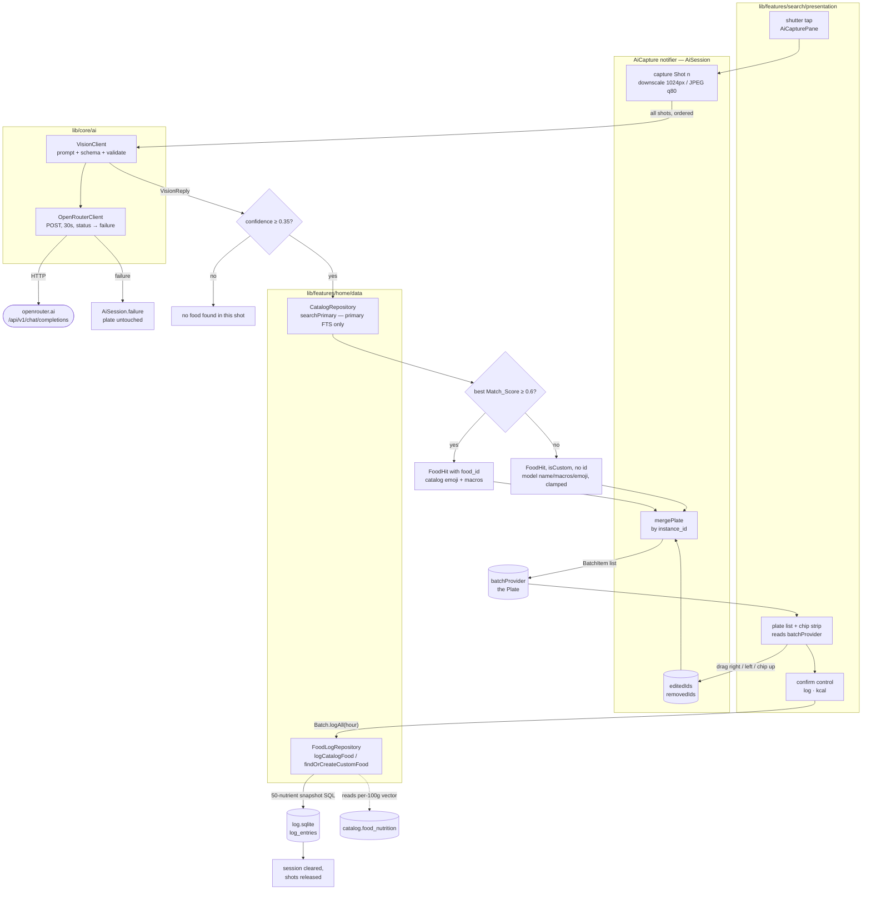

# Design Document

## Overview

AI logging is a third `_Mode` on `SearchScreen`. It does not own a plate of its own: the
**Plate _is_ the existing `Batch`**, so the header totals, the chip strip, the swipe-up-to-remove
chip and the confirm button work with the code already there, and one write path
(`Batch.logAll` → `FoodLogRepository`) reaches `log_entries` for search, quick add and photos
alike. That is decision D1 taken literally, and it is the single most load-bearing choice in this
document — every "reuse" below follows from it.

What is genuinely new is a network round trip in the middle of an otherwise offline app, and the
deduplication that makes multi-shot capture mean something:

- **A batch, not a shot.** Every shutter press sends *all* photos of the batch in one request
  (D4). The reply is the authoritative plate, so dedup happens inside the model, keyed on an
  `instance_id` the model assigns per physical food item and reuses across shots.
- **Merge, never clobber.** The reply is folded into the current plate by `instance_id`. A
  gram amount the user corrected and an item the user swiped away are tracked as sets of instance
  ids on the session, so a later reply cannot undo either (Req 5.9, 5.10).
- **Catalog first, generated food second.** Each detection runs the app's existing
  composite-ranked primary FTS query; a Dart-side name similarity of ≥ 0.6 decides whether the top
  candidate is accepted or the model's own name/macros/emoji become a `custom_foods` row (Req 6, 7).
- **Failure costs the shot, nothing else.** Six failure states, each with the exact copy
  Requirement 11 specifies, and none of them touches the plate.

Three things are deliberately not built: the prototype's preparation wheel (Req 13, catalog has no
per-preparation nutrient variants), the per-shot report strip (no markup renders it), and any
server-side key custody — the OpenRouter key is a `--dart-define` compiled into the binary, which
is the ceiling recorded in D3.

### Research findings that shaped the design

- **OpenRouter multi-image requests.** Several images may be sent as separate entries of one
  message `content` array, each as a base64 data URL, and the docs recommend putting the text part
  **before** the images because of how content is parsed. That fixes the request shape: one text
  part first, then one image part per shot in shot order
  ([image inputs](https://openrouter.ai/docs/guides/overview/multimodal/image-understanding)).
- **Structured outputs.** A schema is supplied as
  `response_format: {type: 'json_schema', json_schema: {name, strict, schema}}`. Support is per
  *endpoint*, not per model, and `provider.require_parameters: true` is the documented way to keep
  a request off endpoints that would ignore the schema. Strict mode is described as enforced by
  some providers and treated as a strong hint by others — so the reply is still validated in Dart
  and Req 11.4's single resend is a real code path, not a formality
  ([structured outputs](https://openrouter.ai/docs/guides/features/structured-outputs)).
  Content was rephrased for compliance with licensing restrictions.
- **Camera permission errors.** `package:camera` surfaces permission failures as
  `CameraException` with codes `CameraAccessDenied` and `CameraAccessDeniedWithoutPrompt` (iOS
  cannot re-prompt), which is exactly the split Req 11.7 needs — the message is the same, the deep
  link to platform settings is what makes the state recoverable
  ([camera plugin](https://pub.dev/packages/camera)).
- **No Dart 3 property-testing library was assumed.** `glados`, the best-known one, caps at
  `<3.0.0` and cannot resolve against this repo's `sdk: ^3.12.2`. `kiri_check` 1.3.1 targets
  `^3.4.0`, integrates with `package:test` (so `flutter test` runs it unchanged) and shrinks
  counterexamples — see [Testing Strategy](#testing-strategy).

## Architecture



### Layering rules this obeys

- **`lib/core/ai/` holds the network client, not the feature.** It mirrors `lib/core/supabase/`:
  compile-time config, a nullable/absent-credential state that is normal rather than an error, and
  no UI strings. The precedent for food knowledge living in `core/` is
  `lib/core/database/nutrients.dart`, which is entirely food-specific and sits in `core/` because
  it is infrastructure shared across features. `search/` therefore gains no `data/` directory and
  the "search owns no repositories" rule holds.
- **`search/` reuses `home/data/`.** `CatalogRepository` gains one public method that exposes the
  primary FTS pass it already runs privately; `FoodLogRepository` gains one insert-or-reuse
  helper. No parallel data layer, and `FoodHit` stays the single row type — a generated food is
  the `FoodHit` third case that already exists (`isCustom` with neither id), which is why
  `Batch.logAll` can write it.
- **No platform branching.** `availableCameras()` is uniform across io and web, so camera
  availability (Req 1.3) is a `try`/`catch` around one call rather than a conditional export.
  `lib/core/database/connection/` remains the only place in `lib/` that branches on platform.
- **All SQL placement is explicit.** Anything naming `catalog.*` is a hand-written `customSelect`
  in a repository; the one new log-only query is a named query in `log.drift`. See
  [Write path](#5-write-path).

## Components and Interfaces

### File-by-file placement

| File | New / edited | Why here |
| --- | --- | --- |
| `lib/core/ai/openrouter_config.dart` | new | Compile-time constants, structurally identical to `core/supabase/supabase.dart`. Cross-cutting; an empty key is a normal state, not an error. |
| `lib/core/ai/openrouter_client.dart` | new | Transport only: one POST, bearer header, 30 s timeout, HTTP status → failure. Knows nothing about food, so a future feature can reuse it. |
| `lib/core/ai/vision_models.dart` | new | `freezed` + `json_serializable` wire models (`VisionReply`, `VisionDetection`) and the sealed `VisionFailure`. Beside the client that produces them. |
| `lib/core/ai/vision_schema.dart` | new | The JSON schema literal and the prompt builders. Separated from the client so a prompt change is reviewable as a diff of one file. |
| `lib/core/ai/vision_client.dart` | new | Assembles the request, sends it through the transport, validates the reply, performs the single revalidation resend. Exposes an abstract `VisionClient` so tests fake it. |
| `lib/features/search/domain/ai_plate.dart` | new | `AiSession`, `AiOrigin`, `PlateCandidate`, `AiPhase`, and the pure `mergePlate` / `clampGrams` / `clampPer100g` functions. Pure logic → `domain/`, and testable with no database and no key. |
| `lib/features/search/domain/food_match.dart` | new | `normalizeName`, `matchScore`, `bestMatch`, `matchThreshold`. Pure, no SQL — the SQL half stays in `CatalogRepository`. |
| `lib/features/search/presentation/ai_providers.dart` | new | `AiCapture` notifier, `aiAvailableProvider`, `visionClientProvider` wiring. Providers live next to what consumes them. |
| `lib/features/search/presentation/ai_capture_pane.dart` | new | Camera preview, torch, shutter, thumbnails, analyzing/failure scrims, reset and confirm controls. |
| `lib/features/search/presentation/ai_plate_list.dart` | new | The plate list, its empty state, and `_PlateRow` built on `SwipeRow`. |
| `lib/features/search/presentation/swipe_row.dart` | new | **Extraction, not a new implementation.** The horizontal drag mechanics currently inside `_ResultRow`, lifted so the result row and the plate row share one recognizer. |
| `lib/features/search/presentation/search_screen.dart` | edited | Adds `_Mode.ai` and the sparkle toggle, swaps the body, mode-dependent chip-strip copy, records removed instance ids on chip dismiss, re-parents `_ResultRow` onto `SwipeRow`. Lifts the existing `// ponytail:` note for AI only — Scan stays out. |
| `lib/features/search/presentation/search_providers.dart` | edited | `BatchItem` gains `final AiOrigin? ai`; `Batch.logAll` routes an AI generated food through insert-or-reuse instead of quick add's one-row-per-entry path. |
| `lib/features/home/data/catalog_repository.dart` | edited | New `searchPrimary()` exposing the existing `_catalogSearch` against `food_fts` only — no trigram append, no custom-food prepend (Req 6.6). Same SQL, same composite rank. |
| `lib/features/home/data/food_log_repository.dart` | edited | New `findOrCreateCustomFood()` (Req 7.7, 7.8) built on the existing `saveCustomFood`. |
| `lib/core/database/log.drift` | edited | One named query, `customFoodByName` — log-only, so it belongs here rather than in Dart. |
| `lib/app/theme.dart` | edited | Three named colours the AI pane needs (`camBg`, `merged`, `danger`) so no widget inlines a hex. |
| `pubspec.yaml` | edited | `camera`, `image`, `http`, `app_settings`; `kiri_check` under dev. |
| `android/app/src/main/AndroidManifest.xml`, `ios/Runner/Info.plist` | edited | `android.permission.CAMERA`; `NSCameraUsageDescription`. |
| `test/ai_merge_test.dart`, `test/ai_match_test.dart`, `test/ai_vision_test.dart`, `test/ai_write_test.dart`, `test/ai_screen_test.dart` | new | See [Testing Strategy](#testing-strategy). |

### 1. App_Config — `lib/core/ai/openrouter_config.dart`

Mirrors `core/supabase/supabase.dart` exactly, including the "empty means disabled" convention
(Req 2.1, 2.2, 2.7, D2).

```dart
const openRouterApiKey = String.fromEnvironment('OPENROUTER_API_KEY');
const openRouterModel =
    String.fromEnvironment('OPENROUTER_MODEL', defaultValue: 'google/gemini-2.5-flash');

/// `https` and a fixed host, so no build flag can redirect captured photos
/// somewhere else (Req 2.5, 12.4).
final openRouterEndpoint = Uri.parse('https://openrouter.ai/api/v1/chat/completions');

/// Empty key means "AI logging disabled" — a normal state, the same way a null
/// `supabaseClient` means "remote sync disabled".
bool get openRouterConfigured => openRouterApiKey.isNotEmpty;

// ponytail: a build-time key ships inside the binary and any user can extract
// it — on web it is readable straight out of the JS bundle. The upgrade path is
// a server-side proxy that holds the key and forwards the request, at which
// point this file keeps only the proxy URL. Accepted for now (D3).
```

Handover command:

```powershell
flutter run --dart-define=OPENROUTER_API_KEY=... --dart-define=OPENROUTER_MODEL=...
```

### 2. Vision_Client — `lib/core/ai/`

```dart
abstract interface class VisionClient {
  /// [shots] are JPEG bytes ordered by shot number, 1-based by position.
  /// [plate] is the current plate, so the model can reuse its instance ids.
  Future<VisionResult> detect({
    required List<Uint8List> shots,
    required List<PlateSummary> plate,
  });
}

typedef PlateSummary = ({String instanceId, String name, int grams});
typedef VisionResult = ({VisionReply? reply, VisionFailure? failure});
```

`OpenRouterVisionClient` implements it over an injected `http.Client`, which is what makes the
whole transport testable with `MockClient` and no key.

#### Request shape

One text part, then one image part per shot in shot order (Req 4.1; text-first is OpenRouter's own
recommendation). Two shots with one item already on the plate:

```json
{
  "model": "google/gemini-2.5-flash",
  "temperature": 0,
  "max_tokens": 2048,
  "provider": { "require_parameters": true },
  "response_format": {
    "type": "json_schema",
    "json_schema": { "name": "plate_detection", "strict": true, "schema": { "...": "below" } }
  },
  "messages": [
    { "role": "system", "content": "<dedup contract, verbatim below>" },
    { "role": "user", "content": [
      { "type": "text", "text":
        "This is one plate photographed 2 times while it was being assembled.\nImage 1 is shot 1. Image 2 is shot 2.\nShot 2 is the newest.\n\nAlready on the plate, with the ids you assigned earlier:\n  a1 | Chicken thigh | 140 g\n\nReuse those ids for the same physical items. Return every food item visible in the newest shot, including items already on the plate." },
      { "type": "image_url", "image_url": { "url": "data:image/jpeg;base64,<shot 1>" } },
      { "type": "image_url", "image_url": { "url": "data:image/jpeg;base64,<shot 2>" } }
    ]}
  ]
}
```

`provider.require_parameters: true` keeps the request off endpoints that would silently ignore
`response_format`. `temperature: 0` because instance ids must be stable across calls, and a
resampled id is a duplicate plate row.

#### The dedup contract (system message)

This is the whole of Requirement 5.1 and 5.2, and it is the one piece of the feature that cannot be
enforced in code — so it is stated as numbered rules rather than prose, and the schema descriptions
repeat the key ones where the model reads them again:

```text
You identify foods on a plate across several photos of the SAME plate, taken while it was
being assembled.

1. One physical food item gets exactly ONE instance_id. Short, lowercase, e.g. a1, a2, a3.
2. Reuse the SAME instance_id for that item in every shot it appears in. The chicken thigh in
   shots 1, 2 and 3 is one item with one id, not three items.
3. Two separate physical items of the same food type get DIFFERENT ids. Two chicken thighs are
   a1 and a2, never one item.
4. If the message lists ids already on the plate, reuse those ids for those same physical items.
   Invent a new id only for an item that is not in that list.
5. "shots" lists every shot number the item appears in, earlier shots included.
6. "grams" is the whole physical item's edible weight as it looks in the newest shot.
7. "search_term" is 1-3 plain words for a food database lookup ("chicken thigh", not
   "grilled chicken thigh with herbs"). "name" is how you would label it to a person.
8. Always fill kcal_100g / protein_100g / carb_100g / fat_100g with per-100 g values for the
   food, even when you expect the database to have it. Never per-item values.
9. Report only food and drink. Ignore plates, cutlery, napkins, hands, table.
```

Rules 1–4 are what makes dedup instance-level rather than name-level, which is why two
indistinguishable thighs stay two plate rows (D11) while one thigh in four photos stays one.

#### Response schema

Strict mode requires every property listed in `required` and forbids extra properties, so
"absent" fields arrive as empty string or `0` and are handled by the clamps rather than by
optionality.

```json
{
  "type": "object",
  "additionalProperties": false,
  "required": ["items"],
  "properties": {
    "items": {
      "type": "array",
      "description": "One entry per physical food item visible across the shots.",
      "items": {
        "type": "object",
        "additionalProperties": false,
        "required": ["instance_id", "name", "search_term", "grams", "confidence",
                     "shots", "emoji", "kcal_100g", "protein_100g", "carb_100g", "fat_100g"],
        "properties": {
          "instance_id": { "type": "string",
            "description": "Stable id for ONE physical item, reused across shots. Two separate items of the same food get different ids." },
          "name":        { "type": "string", "description": "Label for a person, e.g. Chicken thigh." },
          "search_term": { "type": "string", "description": "1-3 plain words for a food database lookup." },
          "grams":       { "type": "number", "description": "Edible weight of this one item, in grams." },
          "confidence":  { "type": "number", "description": "0.0-1.0 confidence that this item is present and correctly named." },
          "shots":       { "type": "array", "items": { "type": "integer" },
            "description": "Every shot number this item appears in, 1-based." },
          "emoji":       { "type": "string", "description": "One emoji for the food, or empty string." },
          "kcal_100g":    { "type": "number", "description": "Energy per 100 g." },
          "protein_100g": { "type": "number", "description": "Protein grams per 100 g." },
          "carb_100g":    { "type": "number", "description": "Carbohydrate grams per 100 g." },
          "fat_100g":     { "type": "number", "description": "Fat grams per 100 g." }
        }
      }
    }
  }
}
```

Representative reply — shot 2 of a batch, one merged item and one new one:

```json
{
  "items": [
    { "instance_id": "a1", "name": "Chicken thigh", "search_term": "chicken thigh",
      "grams": 138, "confidence": 0.93, "shots": [1, 2], "emoji": "🍗",
      "kcal_100g": 209, "protein_100g": 26, "carb_100g": 0, "fat_100g": 11 },
    { "instance_id": "a2", "name": "Mixed leaf salad", "search_term": "mixed salad greens",
      "grams": 85, "confidence": 0.9, "shots": [2], "emoji": "🥗",
      "kcal_100g": 20, "protein_100g": 2, "carb_100g": 3, "fat_100g": 0 }
  ]
}
```

The reply arrives as a JSON *string* inside `choices[0].message.content`, so validation is two
stages: HTTP body → envelope, then content string → `VisionReply`. Either stage failing is
`VisionUnreadable` after the resend.

#### Timeout and the single resend

- 30 s per HTTP attempt, applied with `.timeout()` on the send future (Req 4.4, D5).
- No pre-flight connectivity probe (D6): a socket failure is surfaced as `VisionNoConnection`.
- Schema validation failure → resend the **identical** request exactly once (Req 11.4, D7). A
  network or HTTP failure is *not* retried; only a reply that could not be read is.

```dart
// ponytail: the 30 s budget is per attempt, so a schema resend can take up to
// 60 s wall clock. Wrap both attempts in one Stopwatch budget if that ever
// reads as a hang.
```

#### Error taxonomy

One sealed type, one case per line of Requirement 11, so the pane's copy map is exhaustive and the
compiler proves it:

| Case | Cause | Rendered copy | `retry`? |
| --- | --- | --- | --- |
| `VisionNotConfigured` | empty API key (Req 2.6) | toggle is not rendered at all (Req 1.2), so unreachable from the UI | — |
| `VisionNoConnection` | socket / DNS / `ClientException` | `no connection — detection needs the network` | yes |
| `VisionTimeout` | 30 s elapsed | `detection timed out` | yes |
| `VisionHttpError(status)` | non-2xx | `detection failed · <status>` | yes |
| `VisionUnreadable` | schema invalid after the resend | `could not read the detector's answer` | yes |
| `VisionNoFood` | valid reply, nothing ≥ 0.35 | `no food found in this shot` | no |

Camera permission is **not** in this taxonomy — it is a camera state, `AiPhase.permissionDenied`,
carrying `camera access is off — turn it on in settings` and an `app_settings` deep link (Req 11.7).

`VisionHttpError` carries the status code only. The response body is never attached to a failure
and the request headers are never logged, so the key cannot leak through an error path (Req 12.5).

### 3. Session and providers — `lib/features/search/presentation/ai_providers.dart`

```dart
@riverpod
Future<bool> aiAvailable(Ref ref) async {
  if (!openRouterConfigured) return false;          // Req 1.2
  try {
    return (await availableCameras()).isNotEmpty;   // Req 1.3
  } on CameraException {
    return false;
  } on MissingPluginException {
    return false;                                    // headless test / unsupported host
  }
}

@riverpod
VisionClient visionClient(Ref ref) {
  final client = http.Client();
  ref.onDispose(client.close);
  return OpenRouterVisionClient(client);
}

@riverpod
class AiCapture extends _$AiCapture {
  @override
  AiSession build() => const AiSession();

  Future<void> shoot(Uint8List jpeg) async { ... }   // capture → detect → merge
  Future<void> retry() async { ... }                 // Req 11.9, same shots
  void reset() { ... }                               // Req 3.10, 10.9, 12.3
  void markEdited(String instanceId, double grams) { ... }
  void markRemoved(String instanceId) { ... }
  void setTorch(bool on) { ... }
}
```

**Toolchain check.** No signature above names a drift-generated type, so all three generate
cleanly. `CatalogRepository` and `FoodLogRepository` are hand-written classes, and `FoodHit` is a
plain class in `home/data/` — none of them come out of a `part` file. If a provider here ever needs
to return a drift row class (`TimelineForDayResult` and friends), it must be hand-written the way
`todayEntriesProvider` in `home_providers.dart` is, because `riverpod_generator` throws
`InvalidTypeException` on those types.

`shoot` is the only orchestrator, and it is deliberately linear:

1. append the `Shot` to `state.shots`, set `phase: analyzing`
2. `visionClient.detect(shots: …, plate: …)`
3. failure → `phase: failed, failure: f`, **plate untouched** (Req 11.8), shots kept (Req 11.9)
4. filter `confidence >= 0.35` (Req 4.5, 4.6); empty → `VisionNoFood` (Req 11.6)
5. for each surviving detection: `CatalogRepository.searchPrimary(searchTerm)` →
   `bestMatch(name, candidates)` → catalog `FoodHit` or generated `FoodHit`
6. `mergePlate(...)` over the current `batchProvider` state, then write the whole list back
7. `phase: result`

Step 5 runs sequentially rather than in parallel: a plate is at most a dozen items and each query
is 1–9 ms against a local FTS index, so concurrency buys nothing and would make the SQL-order tie
break in step 6 non-deterministic.

### 4. Catalog_Matcher

**SQL half — reused, not rewritten.** `CatalogRepository._catalogSearch` already runs the
composite-ranked primary query against `food_fts`; `searchPrimary` exposes it:

```dart
/// The primary FTS pass on its own — the same composite-ranked SQL `search`
/// runs first, without the trigram append or the custom-food prepend.
///
/// AI detection needs exactly this: a trigram hit is the lower-confidence
/// answer by construction and must not be a match candidate (Req 6.6), and a
/// generated food must not be matched against a previous generated food's
/// `custom_foods` row — reuse there is by exact name, not by similarity.
Future<List<FoodHit>> searchPrimary(String input, {int limit = 10}) async {
  final term = input.trim();
  if (term.isEmpty) return const [];
  final since = localDate(DateTime.now().subtract(const Duration(days: recencyDays)));
  return _catalogSearch('food_fts', prefixQuery(term),
      'bm25(food_fts, 10.0, 3.0, 1.0)', term, since, limit);
}
```

Nothing about the rank expression changes, so the `prep_type IS 'cooked'`, negative-bm25 and
sort-before-LIMIT invariants documented in `APP_DATABASE.md` are untouched.

**Dart half — `domain/food_match.dart`.** The FTS query has already *ranked* the candidates in SQL;
the Dart score is a **veto**, not a re-rank. It answers one question: is the top-ranked catalog row
actually the same food the model named?

```dart
const matchThreshold = 0.6;   // D8

/// Lowercase, punctuation → single spaces, plural folded, empty tokens dropped.
/// `'Chicken Thighs, cooked'` → `['chicken', 'thigh', 'cooked']`.
List<String> normalizeName(String s) => s
    .toLowerCase()
    .replaceAll(RegExp(r'[^a-z0-9]+'), ' ')
    .trim()
    .split(' ')
    .where((t) => t.isNotEmpty)
    .map(_foldPlural)          // trailing 'es'/'s' dropped above 3 characters
    .toList();

/// Sørensen–Dice over the two token *sets*: `2·|A∩B| / (|A|+|B|)`, so 0.0–1.0
/// with 1.0 only for the same set of words in any order.
double matchScore(String a, String b);

/// The highest-scoring candidate at or above [matchThreshold], else none.
/// Strictly-greater comparison, so a tie keeps the SQL rank order — the
/// composite score already decided which of two equal-similarity rows is the
/// better food.
MatchResult bestMatch(String name, List<FoodHit> candidates);
```

Threshold behaviour, worked:

| Detection name | Candidate display name | Tokens shared | Score | Outcome |
| --- | --- | --- | --- | --- |
| `Cherry tomatoes` | `Cherry tomatoes` | 2 of 2 / 2 | 1.00 | matched |
| `Grilled chicken thigh` | `Chicken thigh, cooked` | 2 | 0.67 | matched |
| `Olive oil` | `Oil, olive, salad or cooking` | 2 | 0.57 | **generated** |
| `Sourdough slice` | `Bread, sourdough` | 1 | 0.50 | **generated** |

```dart
// ponytail: token Dice is an unmeasured metric — "Olive oil" against USDA's
// "Oil, olive, salad or cooking" scores 0.57 and falls to a generated food even
// though the catalog row is right. The upgrade path is to score against
// `catalog.foods.aka` as well as the display name (that column is why "hot dog"
// finds Frankfurter), and to retune 0.6 against a corpus of real replies.
// Lift this only with numbers in hand.
```

Falling back to a generated food is a designed outcome, not a failure (Req 7), which is why an
unmeasured metric is tolerable at this ceiling: the cost of a miss is a `custom_foods` row with
four macros instead of a catalog row with fifty.

### 5. Write path

`Batch.logAll` already does almost all of this. What it does today, unchanged, and which
requirement each part satisfies:

| Existing behaviour | Requirement |
| --- | --- |
| `logCatalogFoodSql` — one `INSERT … SELECT` copying all 50 per-100 g columns, `LEFT JOIN catalog.food_nutrition` | 10.2, 10.3 |
| `customInsert(..., updates: {_db.logEntries})` | 10.8 |
| `loggedAt(at)` → `YYYY-MM-DDTHH:MM`, local, `substring(0, 16)` | 10.4 |
| `logAll(hour:)` → `DateTime(y, m, d, hour)` | 10.5 |
| no `>= 0` validation on the copied vector | 10.6 |
| `f.food_id` selected as a plain integer, no FK | 10.7 |
| `state = const []` at the end | 10.9 (session reset is chained onto it) |
| `portionQty` / `portionLabel` passed through as null for a bare-grams portion | 8.7 |

**SQL placement.** No new `catalog.*` SQL is needed at all — `logCatalogFoodSql` in
`core/database/nutrients.dart` is already the 50-column snapshot, and `searchPrimary` reuses the
existing hand-written `customSelect`. Exactly one new statement is required, and it is log-only, so
it is a **named query in `log.drift`**:

```sql
-- Insert-or-reuse for a model-generated food: a second session that detects the
-- same off-catalog food logs against the row the first session wrote (D10),
-- rather than quick add's deliberate one-row-per-entry.
customFoodByName:
SELECT id FROM custom_foods
 WHERE deleted = 0 AND lower(trim(name)) = lower(trim(:name))
 ORDER BY updated_at DESC LIMIT 1;
```

Single-column, so drift generates `Selectable<String>` with no result class — nothing here can
trip the `InvalidTypeException` gotcha. No new index: a scan of a few hundred `custom_foods` rows
measures well under a millisecond, the same reasoning `_customSearch` already records.

```dart
// ponytail: SQLite's lower() is ASCII-only, so 'Crème brûlée' and 'CRÈME
// BRÛLÉE' would be two rows. Fold in Dart if a non-ASCII generated name ever
// shows up twice.
```

`FoodLogRepository.findOrCreateCustomFood` wraps it over the existing `saveCustomFood`:

```dart
/// Req 7.7, 7.8. `servingG`/`servingLabel` stay NULL, so the food reads as per
/// 100 g and logs as bare grams — `saveCustomFood`'s divisor is then 1 and the
/// clamped per-100 g values land verbatim (D9).
Future<String> findOrCreateCustomFood({
  required String name,
  String? emoji,
  required Map<String, double> per100g,
}) async =>
    await _db.customFoodByName(name).getSingleOrNull() ??
    // `perServing` is the existing parameter name; with `servingG` null it is
    // per 100 g.
    await saveCustomFood(name: name.trim(), emoji: emoji, perServing: per100g);
```

`Batch.logAll`'s one new branch — the discriminator is `item.ai`, so quick add keeps its
documented ponytail and only the AI path dedupes:

```dart
final id = food.customFoodId ??
    (item.ai != null
        ? await repo.findOrCreateCustomFood(
            name: food.name, emoji: food.emoji, per100g: {...})
        : await repo.saveCustomFood(/* unchanged quick-add shape */));
```

Requirement 7.9 (`custom_food_id` set, `food_id` NULL) and its converse for a catalog match are
already guaranteed by `log_entries`' `CHECK ((food_id IS NULL) <> (custom_food_id IS NULL))` plus
the two separate insert statements — there is no third case to get wrong.

### 6. UI composition

Every colour comes from `AppColors`; every macro line comes from `macroLine`. Three colours are
added to `theme.dart` rather than inlined:

```dart
/// The camera pane's own background — a stop darker than [bg], from the design.
static const camBg = Color(0xFF0A0B08);
/// Repeats the carbs hue under a semantic name: the `↺ N` merge badge.
static const merged = Color(0xFF7FBF6A);
/// Repeats the protein hue under a semantic name: the remove affordance.
static const danger = Color(0xFFE5705C);
```

#### Header (edited `search_screen.dart`)

`enum _Mode { search, ai, quick }`. The sparkle toggle sits between search and quick (Req 1.1),
rendered only when `aiAvailableProvider` resolves true, and reuses `_modeButton` unchanged —
40×40 circle, amber when on, `AppColors.badgeBg` otherwise. The existing `// ponytail:` note is
narrowed to Scan alone.

#### Camera pane — `AiCapturePane`, prototype `camStyle`

`SizedBox(height: 396)` over `AppColors.camBg`, a `Stack`:

| Layer | Prototype source | Content |
| --- | --- | --- |
| fill | `camStyle` | `CameraPreview` while live; `Image.memory` of the newest shot once one exists; centred `[ LIVE CAMERA FEED ]` at 8.5 px / letter-spacing 1.6 / `dim(.22)` when no preview frame is available (Req 3.1) |
| top-right | `torchStyle` | 34×34 circle at top 10 / right 14, amber fill when on else `bg` at 72% with a `dim(.16)` border (Req 3.11) |
| fill, while analyzing | `aiAnalyzing` block | scrim `#080907` at 50%, a 2 px amber sweep bar inset 24, `ANALYZING PLATE` at 10 px / ls 1.8 / amber, and the sub-label at 9.5 px / `dim(.45)`: `detecting foods and portions`, or `comparing with N earlier shot(s)` for shot > 1 (Req 3.4) |
| fill, while failed | — | same scrim, the failure copy at 11 px / `dim(.6)`, and a `retry` pill matching `resetStyle` (Req 11.1–11.6) |
| bottom, 88 px | bottom gradient bar | `LinearGradient` transparent → `#080907` at 82%, `Row` of three parts |

The bottom row, left to right:

- `Expanded` → `reset stack` pill (h 36, radius 18, `dim(.28)` border, 11.5 px semibold), shown
  only once a shot exists (Req 3.9), then a horizontally scrolling strip of 30×30 radius-7
  numbered thumbnails for the 5 most recent shots, newest outlined `AppColors.amber` and older
  ones `dim(.16)` (Req 3.6). When the batch holds 8, the strip is replaced by
  `shot limit reached — log or reset the stack` at 9.5 px / `dim(.45)` (Req 3.8).
- Shutter: 62 px ring (2 px, `dim(.85)`) around a 48 px amber disc that scales to 0.82 and drops to
  45% opacity while analyzing; `onTap` null while analyzing or at 8 shots (Req 3.5, 3.7).
- `Expanded`, right-aligned → confirm pill (h 36, radius 18): amber with `AppColors.bg` text and
  `log <kcal>` when the plate is non-empty, else transparent with a `dim(.2)` border, `dim(.35)`
  text, `log`, and a null `onTap` (Req 9.9–9.11). Enabled even while a detection is in a failed
  state (Req 11.10) — it reads `batchProvider`, not `AiSession.phase`.

#### Plate list — `ai_plate_list.dart`

Empty (Req 9.2): padding 22/16, 11 px, `dim(.35)`, line height 1.6, the exact prototype copy.

Each row is `_PlateRow` inside `SwipeRow`, laid out as the prototype's `plateRows`: 34 px emoji
column at 24 px, then a flexible column of

1. name at 13 px `AppColors.fg`, ellipsized, followed by the badge — `↺ N` in `AppColors.merged`
   with a 40%-alpha border when the shot list holds more than one (Req 5.6), `new` in amber with a
   45%-alpha border when it holds exactly one and that one is the newest shot (Req 5.7), and
   nothing otherwise;
2. `macroLine(kcal, p, c, f)` at 10 px — every figure `grams / 100 × per-100 g` (Req 8.6, 9.1);
3. the sub-line at 10 px `dim(.35)`: `<grams> g` alone, or
   `<grams> g · shots 1·2·3, counted once` when merged (Req 5.6).

```dart
// ponytail: the design's preparation wheel is omitted. catalog.foods.prep_type
// is 48% populated and carries no per-preparation nutrient variants for the
// wheel to switch between, so it would render choices with identical numbers.
// The upgrade path is a merged_foods variant picker — the same rows
// MIGRATION_MERGED_FOODS.md describes — driving the wheel. Req 13.
```

#### `SwipeRow` — the extraction

`_ResultRow` in `search_screen.dart` already carries the mechanics both rows need, including the
non-obvious part worth keeping: the horizontal recognizer reads **both** axes off `globalPosition`,
because its own `delta` carries the primary axis only, so a vertical drag still scrolls the list
until a horizontal one wins the arena. Duplicating that would be a bug waiting to happen, so it
moves into one widget:

```dart
class SwipeRow extends StatefulWidget {
  const SwipeRow({
    required this.unitG,          // ladder base — food.unitG, or the item's grams
    this.unitLabel,
    required this.onPicked,       // right release with a Portion
    this.onRemove,                // left release past the arm threshold; null = no left action
    this.onTap,
    required this.builder,        // (context, picked, shift, removing) => content
  });
}
```

`portionForDrag` from `domain/portion.dart` is the ladder, unchanged, so Req 9.3's "existing
portion ladder" is literal. Both callers keep their own painting through `builder`: the result row
its amber gradient and left-hand label, the plate row additionally the right-hand
`remove` → `release to remove` label (84 px, `AppColors.danger` when armed at `dx < -46`, 55%
alpha before) and the reversed red gradient (Req 9.5).

Release behaviour differs only in the callback: the result row **stages** a new `BatchItem`; the
plate row **rewrites** the existing one's grams via `Batch.replace` and calls
`markEdited(instanceId, grams)` (Req 9.4), or removes it and calls `markRemoved(instanceId)`
(Req 9.6).

Risk, called out: this refactors a screen covered by `test/search_test.dart`, whose
`_swipeToStage` helper hand-rolls a multi-frame drag because `tester.drag` delivers every move in
one frame. The extraction must keep the recognizer wiring identical, and that test passing
unchanged is the acceptance bar.

#### Chip strip (edited `search_screen.dart`)

Already renders `batchProvider`, so Req 1.5 is free. Two changes:

- empty copy switches on mode: `plate is empty — shoot to detect foods` in AI mode (Req 1.6),
  the existing batch copy otherwise;
- `Dismissible.onDismissed` routes through one helper that removes the `BatchItem` and, when
  `item.ai != null`, also records the instance id as user-removed (Req 9.7).

Chip labels ellipsize as they already do — the prototype's hand-written `short` names have no
catalog equivalent (D16).

#### Capture and downscale

`camera`'s `takePicture()` → `XFile.readAsBytes()` → `compute(downscaleJpeg, bytes)`, where
`downscaleJpeg` uses `package:image` to decode, `copyResize` only if the longest edge exceeds
1024 px, and `encodeJpg(quality: 80)` (Req 3.12, D14). `compute` because decoding a multi-megapixel
frame on the UI isolate drops frames; on web it degenerates to a same-isolate call, which is
acceptable for a dev target.

Shots live in `AiSession.shots` as `Uint8List` for the life of the batch and are dropped on
confirm, reset, or leaving the screen (Req 12.1–12.3).

```dart
// ponytail: camera.takePicture() writes the frame into the plugin's temp cache
// before we read the bytes — the plugin has no in-memory capture API and
// deleting the file would need a dart:io branch, which only
// core/database/connection/ is allowed to have. Nothing is ever copied into the
// documents directory or either database. Lifting this means capturing from the
// preview image stream instead.
```

## New dependencies

Four runtime packages and one dev package. Versions are the latest published at design time and are
written as carets to match every existing entry in `pubspec.yaml`; the exact resolved version each
was checked against is in the last column, so a strict pin is a one-character edit if that is
preferred later.

| Package | Constraint | Resolved | Why this one |
| --- | --- | --- | --- |
| `camera` | `^0.12.0+2` | 0.12.0+2 | The Flutter-team plugin. Supplies everything Requirement 3 needs and nothing more: `availableCameras()` for the availability gate, `CameraPreview` for the live pane, `takePicture()`, and `setFlashMode(FlashMode.torch)` for the torch. Its `CameraException` codes are the exact permission split Req 11.7 describes. |
| `image` | `^4.9.1` | 4.9.1 | Pure-Dart decode / `copyResize` / `encodeJpg(quality: 80)` for the 1024 px rule (D14). Chosen over `flutter_image_compress` (2.5.1), which is faster because it is native but has **no web implementation** — that would break the dev web target for a path that has no performance requirement. |
| `http` | `^1.6.0` | 1.6.0 | One POST with a bearer header, on io and web from one code path. `dart:io`'s `HttpClient` does not compile for web, and its use would force a platform branch that only `core/database/connection/` is allowed to have. Brings `package:http/testing.dart`'s `MockClient`, which is how the transport is tested with no key. |
| `app_settings` | `^8.0.3` | 8.0.3 | Requirement 11.7's "control that opens the platform settings screen". Chosen over `permission_handler` (12.0.3) because no permission *state machine* is needed — `camera` already reports the denial — only the deep link, and this is the smaller surface. Third-party rather than flutter.dev, and a no-op on web. |
| `kiri_check` | `^1.3.1` (dev) | 1.3.1 | Property-based testing. Integrates with `package:test`, so `flutter test` runs the properties unchanged. `glados` was rejected: its `<3.0.0` SDK bound cannot resolve against `sdk: ^3.12.2`. |

Platform configuration that comes with `camera`:

- **Android** — `<uses-permission android:name="android.permission.CAMERA"/>` in
  `AndroidManifest.xml`. `INTERNET` is already declared.
- **iOS** — `NSCameraUsageDescription` in `Info.plist`. Microphone is **not** requested: no video is
  recorded, and asking for it would be a permission prompt with no feature behind it.
- **`minSdk` / iOS deployment target** — `camera` 0.12 raises the Android floor; the project uses
  `flutter.minSdkVersion`, so the Flutter SDK's floor applies and no explicit bump is written unless
  `flutter pub get` reports a conflict.

### What this changes about the web build

`web/` is a dev-testing target, so the bar is "still compiles and still runs the rest of the app",
not "AI logging works in a browser". Flagged concretely:

- `camera`'s endorsed `camera_web` implementation is pulled in automatically, so the build keeps
  compiling. It needs a **secure context** — Vercel serves HTTPS, so that holds.
- On a desktop browser with no camera, `availableCameras()` returns empty and the toggle simply does
  not render (Req 1.3). That is the expected web state, not a bug.
- `compute()` on web runs on the same thread, so downscaling a large frame will jank the dev build.
  Accepted: the alternative is a web worker for a target nobody ships.
- **Browser CORS against OpenRouter is unverified from this repo.** If the preflight is rejected,
  the web dev build loses AI logging while mobile is unaffected — the failure surfaces as
  `VisionNoConnection`, which is already a designed state.
- `app_settings` has no web behaviour; the permission-denied control will do nothing there.
- `web/sqlite3.wasm` and the `sqlite3` package version are untouched. No new asset is bundled.

```dart
// ponytail: on web the build-time key is readable straight out of the JS
// bundle, which is a strictly worse version of the D3 ceiling than on mobile.
// The same server-side proxy fixes both. Until then, treat the web build as a
// dev target and do not deploy it with a production key.
```

## Data Models

### Wire models — `lib/core/ai/vision_models.dart`

`freezed` + `json_serializable`, snake_case wire names mapped explicitly so a schema rename is a
one-line diff:

```dart
@freezed
abstract class VisionReply with _$VisionReply {
  const factory VisionReply({@Default([]) List<VisionDetection> items}) = _VisionReply;
  factory VisionReply.fromJson(Map<String, dynamic> json) => _$VisionReplyFromJson(json);
}

@freezed
abstract class VisionDetection with _$VisionDetection {
  const factory VisionDetection({
    @JsonKey(name: 'instance_id') required String instanceId,
    required String name,
    @JsonKey(name: 'search_term') required String searchTerm,
    required double grams,
    required double confidence,
    @Default([]) List<int> shots,
    @Default('') String emoji,
    @JsonKey(name: 'kcal_100g') @Default(0) double kcal100g,
    @JsonKey(name: 'protein_100g') @Default(0) double protein100g,
    @JsonKey(name: 'carb_100g') @Default(0) double carb100g,
    @JsonKey(name: 'fat_100g') @Default(0) double fat100g,
  }) = _VisionDetection;
  factory VisionDetection.fromJson(Map<String, dynamic> json) =>
      _$VisionDetectionFromJson(json);
}
```

Validation is "does `fromJson` produce a `VisionReply` whose every item has a non-empty
`instanceId` and a non-empty trimmed `name`" (Req 7.4 drops the rest). A `FormatException` or a
`TypeError` out of `fromJson` is the same outcome as a semantically empty item: resend once, then
`VisionUnreadable`.

```dart
sealed class VisionFailure {
  const VisionFailure();
}
final class VisionNotConfigured extends VisionFailure { const VisionNotConfigured(); }
final class VisionNoConnection  extends VisionFailure { const VisionNoConnection(); }
final class VisionTimeout       extends VisionFailure { const VisionTimeout(); }
final class VisionHttpError     extends VisionFailure { const VisionHttpError(this.status); final int status; }
final class VisionUnreadable    extends VisionFailure { const VisionUnreadable(); }
final class VisionNoFood        extends VisionFailure { const VisionNoFood(); }
```

Sealed, so the pane's copy map is exhaustive by compiler check and adding a seventh failure cannot
silently render nothing.

### Session and plate — `lib/features/search/domain/ai_plate.dart`

```dart
enum AiPhase { live, analyzing, result, failed, permissionDenied }

/// A captured photo. Numbered from 1 within the batch, held only in memory.
@freezed
abstract class Shot with _$Shot {
  const factory Shot({required int number, required Uint8List jpeg}) = _Shot;
}

/// What makes a staged [BatchItem] an AI detection rather than a search hit.
@freezed
abstract class AiOrigin with _$AiOrigin {
  const factory AiOrigin({
    required String instanceId,
    required List<int> shots,
    required bool generated,
  }) = _AiOrigin;
}

/// A detection after confidence filtering, catalog matching and clamping —
/// everything the merge needs, with nothing left to decide.
@freezed
abstract class PlateCandidate with _$PlateCandidate {
  const factory PlateCandidate({
    required String instanceId,
    required FoodHit food,
    required double grams,
    required List<int> shots,
    required bool generated,
  }) = _PlateCandidate;
}

@freezed
abstract class AiSession with _$AiSession {
  const factory AiSession({
    @Default([]) List<Shot> shots,
    @Default(AiPhase.live) AiPhase phase,
    VisionFailure? failure,
    @Default(false) bool torchOn,

    /// Instance ids whose grams the user set by hand. A later reply keeps the
    /// user's number for these (Req 5.9).
    @Default(<String>{}) Set<String> editedIds,

    /// Instance ids the user swiped off the plate or off the chip strip. A
    /// later reply must not put them back (Req 5.10).
    @Default(<String>{}) Set<String> removedIds,
  }) = _AiSession;

  int get shotCount => shots.length;
  bool get atShotLimit => shots.length >= maxShots;  // 8, D13
}
```

**Why the two flag sets live on the session and not on the row.** A removed item has no row left
to carry a flag, so at least one of the two has to live above the plate; splitting them would put
half the re-analysis rules in one place and half in another. Keeping both here makes the merge a
pure function of `(batch, candidates, editedIds, removedIds, newestShot)` — which is precisely what
makes it unit-testable against canned replies with no camera, no key and no database.

**Why there is no `PlateItem` type.** The plate row type is the existing `BatchItem`, extended with
one nullable field. Two lists of plate state would be two things to keep in step; one list is the
whole point of D1.

```dart
// search_providers.dart
class BatchItem {
  const BatchItem(this.food, this.portion, {this.ai});
  final FoodHit food;
  final Portion portion;
  /// Null for a search hit or a quick entry. Non-null marks an AI detection,
  /// and is what routes a generated food through insert-or-reuse on the way out.
  final AiOrigin? ai;
  ...
}
```

`BatchItem` has no value equality and `Batch` operates by `identical`, which stays true here:
`mergePlate` returns new `BatchItem` instances and replaces the whole list in one assignment, so
nothing depends on comparing two of them.

### Pure transforms — same file

```dart
const confidenceFloor = 0.35;   // D12
const maxShots = 8;             // D13
const minGrams = 1.0, maxGrams = 2000.0, defaultGrams = 100.0;

/// Req 8.2–8.5. Outside 1–2000 g the model's number is not a portion estimate,
/// it is noise — so fall back to the catalog serving, else 100 g.
double clampGrams(double reported, {double? servingG}) =>
    reported >= minGrams && reported <= maxGrams
        ? reported.roundToDouble()
        : (servingG ?? defaultGrams);

/// Req 7.6. `custom_foods` carries `CHECK (<nutrient> IS NULL OR >= 0)`, so a
/// negative generated value would fail the insert. Note this is the opposite of
/// the catalog path, where a negative `carb_g` is real USDA
/// carbohydrate-by-difference and must survive untouched (Req 10.6).
Map<String, double> clampPer100g(VisionDetection d);

/// Req 5.3–5.5, 5.8–5.10. The whole of batch deduplication, as one pure
/// function over the staged list.
List<BatchItem> mergePlate({
  required List<BatchItem> batch,
  required List<PlateCandidate> candidates,
  required Set<String> editedIds,
  required Set<String> removedIds,
});
```

`mergePlate`'s contract, in order:

1. every `BatchItem` with `ai == null` passes through untouched, in place — a search hit or quick
   entry staged before switching modes is not the model's business (Req 1.7);
2. a candidate whose id is in `removedIds` is skipped entirely (Req 5.10);
3. a candidate whose id matches a staged item **rewrites that item in place**: shots become the
   sorted union of both lists (Req 5.3), the plate length is unchanged (Req 5.4), the food and
   emoji are refreshed from the candidate, and grams are the candidate's *unless* the id is in
   `editedIds`, in which case the user's number stands (Req 5.9);
4. a candidate whose id matches nothing is appended (Req 5.5);
5. a staged AI item whose id appears in no candidate stays exactly as it is, shots included
   (Req 5.8).

Steps 3 and 5 together are why a failed request cannot damage the plate: with no candidates, the
merge is the identity function.

## Correctness Properties

*A property is a characteristic or behavior that should hold true across all valid executions of a
system — essentially, a formal statement about what the system should do. Properties serve as the
bridge between human-readable specifications and machine-verifiable correctness guarantees.*

Property-based testing applies here because the load-bearing parts of this feature are pure
functions over generated inputs: `mergePlate` folds an arbitrary reply into an arbitrary plate,
`clampGrams` and `clampPer100g` map arbitrary numbers into a legal range, and `matchScore` maps
arbitrary name pairs into `0.0`–`1.0`. The camera, the network and the widget tree are covered by
example, integration and widget tests instead — see [Testing Strategy](#testing-strategy).

The set below is the consolidated one. The prework analysis found several groups of criteria that
are views of one function — `5.3`/`5.4`/`5.5` are three readings of "one item per id",
`8.2`–`8.5` are four branches of `clampGrams`, `6.3`/`6.4`/`6.5`/`6.7`/`7.2`/`7.5` are all
consequences of one resolution decision — and each group became a single property rather than
several tests of the same code. Requirement 11's copy assertions stayed examples: the failure type
is sealed, so an exhaustive `switch` is complete where a hundred random draws would not be.

### Property 1: The plate holds exactly one item per instance id

*For any* staged plate, *any* reply and *any* set of user-removed instance ids, the merged plate
contains exactly one item per distinct instance id that is either already staged or newly detected
and not user-removed, no item for any other id, and each item's shot list is the sorted set union
of its previous shots and every shot number the reply reports for that id.

**Validates: Requirements 5.3, 5.4, 5.5, 5.10**

### Property 2: Merging is idempotent

*For any* staged plate and *any* reply, merging that reply twice produces the same plate as merging
it once — same items, same grams, same shot lists, same order.

**Validates: Requirements 5.3, 5.4, 5.8**

### Property 3: Merging preserves what the reply does not mention

*For any* staged plate and *any* reply, every plate item whose instance id appears in no detection
of that reply is present afterwards with its gram amount and shot list unchanged — so merging an
empty reply, which is what every failure produces, is the identity function on the plate.

**Validates: Requirements 5.8, 11.8**

### Property 4: A user-edited gram amount survives every later reply

*For any* staged plate, *any* set of user-edited instance ids and *any* reply, every plate item
whose instance id is user-edited holds the same gram amount after the merge as before it.

**Validates: Requirements 5.9, 9.4**

### Property 5: Items staged by search or quick add are never touched

*For any* staged list mixing AI detections with search hits and quick entries, and *any* reply,
every item with no AI origin is present afterwards, unmodified and in its original relative order.

**Validates: Requirements 1.7**

### Property 6: Only confident, named detections reach the plate

*For any* reply, a detection contributes a plate item if and only if its confidence is at least
`0.35` and its name is non-empty after trimming whitespace.

**Validates: Requirements 4.5, 4.6, 7.4**

### Property 7: Shot numbers are 1..n with no gaps and no repeats

*For any* number of shutter presses up to the batch limit, the captured shots are numbered exactly
`1` through `n` in capture order, and the batch never holds more than 8 shots.

**Validates: Requirements 3.2, 3.7**

### Property 8: The thumbnail strip is the last five shots, newest accented

*For any* shot count from `1` to `8`, the rendered thumbnail numbers are exactly the final
`min(n, 5)` numbers of `1..n` in ascending order, and the accented thumbnail is the one numbered
`n`.

**Validates: Requirements 3.6**

### Property 9: A plate row renders every field, with the badge its shot list implies

*For any* plate item, the rendered row carries the emoji, the display name, the kilocalorie and
protein/carbohydrate/fat figures and the gram sub-line; the badge reads `↺ N` for a shot list of
`N > 1` and the sub-line then ends `· shots <numbers joined by ·>, counted once`; the badge reads
`new` for a single shot equal to the newest shot number; and no badge renders for a single shot that
is not the newest.

**Validates: Requirements 5.6, 5.7, 9.1**

### Property 10: Match_Score is a bounded, symmetric similarity

*For any* pair of food names, the Match_Score lies within `0.0`–`1.0` inclusive, is unchanged when
the two names are swapped, and equals `1.0` exactly when the two names normalize to the same token
set.

**Validates: Requirements 6.2**

### Property 11: The threshold alone decides catalog versus generated

*For any* detection and *any* list of primary-FTS candidates, the detection resolves to a candidate
if and only if some candidate scores at least `0.6`. When it resolves, the chosen candidate holds
the maximum score and the plate item takes that candidate's `food_id`, coalesced display name and
emoji. When it does not, the plate item is a generated food carrying the detection's own name and
macros, and a non-empty emoji.

**Validates: Requirements 6.3, 6.4, 6.5, 6.7, 6.8, 7.2, 7.5**

### Property 12: Gram amounts land in a loggable range

*For any* reported gram amount and *any* catalog serving weight, the resulting plate amount is the
reported amount rounded to a whole gram when it lies within `1`–`2000` inclusive, otherwise the
catalog serving weight when one exists, otherwise `100` — and is always strictly positive.

**Validates: Requirements 8.2, 8.3, 8.4, 8.5**

### Property 13: Generated per-100 g values satisfy the custom_foods constraints

*For any* detection, every per-100 g nutrient value carried onto a generated plate item is greater
than or equal to zero, so the row it becomes can never fail a `custom_foods` non-negative CHECK.

**Validates: Requirements 7.6**

### Property 14: Every nutrient figure is the per-100 g vector scaled by grams

*For any* plate, every rendered kilocalorie and macro figure equals that item's gram amount divided
by `100` multiplied by the corresponding per-100 g value, and the header totals equal the sum of
those figures across the plate.

**Validates: Requirements 8.6, 9.8**

### Property 15: Every plate item becomes exactly one log row of a fixed shape

*For any* confirmed plate, and with every detection request failing, the number of `log_entries`
rows written equals the number of plate items; each row carries exactly one of `food_id` /
`custom_food_id`, with `food_id` a plain integer; each has NULL `portion_qty` and `portion_label`;
and each `logged_at` matches `YYYY-MM-DDTHH:MM`.

**Validates: Requirements 5.11, 7.9, 8.7, 10.1, 10.4, 10.7, 11.11**

### Property 16: An hour argument pins logged_at to that hour

*For any* hour from `0` to `23`, every row written by a confirmed plate carries that hour in
`logged_at` characters 11–13 and `00` as its minutes, on the current local date.

**Validates: Requirements 10.5**

### Property 17: A matched item's nutrient vector equals the catalog's, unadjusted

*For any* catalog-matched plate item, all 50 per-100 g nutrient columns of the written
`log_entries` row equal the corresponding `catalog.food_nutrition` columns for that `food_id`, with
no preparation adjustment applied and negative values preserved.

**Validates: Requirements 10.2, 10.6, 13.2**

### Property 18: Generated foods are inserted once and reused after

*For any* sequence of confirmed plates containing generated foods, the number of non-deleted
`custom_foods` rows equals the number of distinct generated names under trimming and case folding,
and every log row for a given name references the same `custom_foods` id.

**Validates: Requirements 7.7, 7.8**

### Property 19: Ending a batch releases every shot and every AI plate item

*For any* session state, ending the batch by confirming, by reset, or by leaving the screen leaves
no shot in memory, no AI-origin item on the plate, and the pane in its live state — while items
staged by search or quick add survive a confirm.

**Validates: Requirements 3.10, 10.9, 12.3**

### Property 20: A request carries all shots, in order, only when the user asked

*For any* sequence of shutter presses and retries, every HTTP request targets the HTTPS OpenRouter
endpoint, carries one image part per shot of the current batch ordered by shot number after a
single leading text part, and the number of requests equals the number of shutter presses plus
retries plus schema resends.

**Validates: Requirements 2.5, 4.1, 11.9, 12.1, 12.4**

### Property 21: Every staged instance id reaches the request text

*For any* staged plate, the request's text part contains the instance id, the name and the gram
amount of every plate item, so the model can reuse every id it previously assigned.

**Validates: Requirements 4.2**

### Property 22: A reply that fails validation is sent exactly twice

*For any* response body that fails schema validation, the Vision_Client issues exactly two requests
and then reports `could not read the detector's answer`; *for any* body that passes, it issues
exactly one.

**Validates: Requirements 11.4, 11.5**

### Property 23: No failure or error message contains the API key

*For any* Vision_Client failure and *any* exception the client throws, the string form of that value
does not contain the configured API key.

**Validates: Requirements 2.7, 12.5**

## Error Handling

**The plate is never collateral.** Every failure path in `AiCapture.shoot` sets `phase` and
`failure` and returns without touching `batchProvider` (Req 11.8). The shots stay in the session so
`retry` resends the same batch (Req 11.9), and the confirm control reads the batch rather than the
phase, so a failed detection does not block logging what is already staged (Req 11.10).

| Situation | Handling |
| --- | --- |
| Empty API key | `aiAvailableProvider` is false → the toggle never renders (Req 1.2). `VisionClient.detect` still short-circuits to `VisionNotConfigured` before building a request, so a programming error cannot send an unauthenticated call (Req 2.6). |
| No camera on the platform | `availableCameras()` empty or throwing → toggle hidden (Req 1.3). This is the normal desktop-browser state for the web dev build. |
| Camera permission denied | `CameraException` with `CameraAccessDenied` / `CameraAccessDeniedWithoutPrompt` → `AiPhase.permissionDenied`, copy `camera access is off — turn it on in settings`, plus an `app_settings` deep link (Req 11.7). |
| Socket / DNS / `http.ClientException` | `VisionNoConnection`. No pre-flight probe, by decision D6 — an attempt that fails is the connectivity answer. |
| 30 s elapsed | `VisionTimeout`, request aborted (Req 4.4). |
| Non-2xx | `VisionHttpError(status)`, rendered as `detection failed · <status>` (Req 11.3). Status only — never the body, which can echo request content. |
| Malformed or schema-violating reply | one identical resend (Req 11.4), then `VisionUnreadable` (Req 11.5). The plate is untouched throughout (D7). |
| Valid reply, nothing ≥ 0.35 | `VisionNoFood`, copy `no food found in this shot`, **no** retry control — resending the same photos gets the same answer (Req 11.6). |
| Reply item with an empty trimmed name | dropped silently (Req 7.4). If that empties the reply, the outcome is `VisionNoFood`. |
| Reply item with an empty emoji | `🍽️` (Req 7.5), the same fallback the chip strip and result row already use. |
| Catalog food with no `food_nutrition` row | `logCatalogFoodSql`'s existing `LEFT JOIN` writes NULL nutrients (Req 10.3). Two catalog foods are in this state. |
| Negative catalog `carb_g` | copied through untouched. The `>= 0` clamp applies **only** to generated foods, because `custom_foods` carries the CHECK and `log_entries` deliberately does not (Req 10.6, 7.6). |
| 8 shots reached | shutter rejects taps and the strip explains why (Req 3.7, 3.8). Confirm and reset both stay live. |
| Shutter tapped while analyzing | rejected (Req 3.5); the shutter also renders at 45% opacity so the rejection is visible rather than silent. |
| Key in a log or error string | structurally impossible: the key is read at the send site, headers are never attached to a failure, and no `VisionFailure` case carries a string field (Req 12.5). |

## Testing Strategy

Everything below runs from the **repo root** with `flutter test`, offline, with **no API key** —
`test/catalog_test.dart` already attaches `database/foods.sqlite` by relative path, and the new
database-backed tests use the same `AppDatabase(NativeDatabase.memory(), catalogPath:
'database/foods.sqlite')` setup.

### Faking the Vision_Client

Two levels, because they answer different questions:

- **`FakeVisionClient implements VisionClient`** — returns canned `VisionReply`s or a chosen
  `VisionFailure`, and records the `(shots, plate)` it was called with. Used by every merge, match,
  write and widget test. Overridden through `visionClientProvider`.
- **`MockClient` from `package:http/testing.dart`** (arrives with `http`, no new dependency) —
  exercises `OpenRouterVisionClient` itself against canned HTTP responses: the request body shape,
  the status mapping, the resend, the timeout.

Canned replies live in `test/fixtures/vision_replies.dart` as a four-shot sequence ported from the
prototype's `SHOTS` table — chicken through shot 1, chicken + tomato + greens in shot 2, oil and
bread added in shot 3, feta in shot 4 — which is the exact scenario the `↺ 3` badge and the
`shots 1·2·3, counted once` sub-line were designed for.

### Property-based tests

`kiri_check: ^1.3.1` under `dev_dependencies`. It integrates with `package:test`, so `flutter test`
runs these unchanged; `glados` was rejected because its `<3.0.0` SDK bound cannot resolve against
`sdk: ^3.12.2`.

- Every property test runs **at least 100 examples** (`KiriCheck.maxExamples = 100` in a shared
  `setUpAll`, raised per-property where the generator is cheap).
- Each test is tagged with a comment naming the design property it implements:
  `// Feature: ai-food-logging, Property 3: Merging is idempotent`.
- One property, one property-based test. Nothing is asserted twice under two names.

Generators needed: `VisionDetection` (arbitrary ids drawn from a small alphabet so collisions are
common rather than rare, grams spanning well outside 1–2000, confidence spanning 0–1, negative
nutrients, empty names and emoji), `List<BatchItem>` mixing AI and non-AI origins, and food-name
pairs built by perturbing a shared token pool so `matchScore` sees near-misses rather than
unrelated strings.

Where each property runs:

- **Pure, no database, no widgets** — Properties 1–7, 12, 13, 14. These are `mergePlate`,
  the admission filter, shot numbering and the two clamps, which is where the feature's real logic
  lives.
- **Widget tests with a faked Vision_Client** — Properties 8, 9. Rendering rules over a generated
  plate; the harness has no camera, which is why the pane's placeholder branch is the one under
  test.
- **Catalog attached to an in-memory log** — Properties 15, 16, 17, 18. The plate is constructed
  directly rather than through the camera, and Property 15 runs with every detection request failing
  so Requirement 11.11's "confirm needs no network" falls out of it.
- **`MockClient` against `OpenRouterVisionClient`** — Properties 20, 21, 22, 23. Request shape,
  request accounting, resend accounting, and the key-leak assertion using a distinctive test key so
  a false negative is impossible.
- **Property 19** spans the session notifier and the write path: pure for the reset and leave
  triggers, catalog-attached for the confirm trigger.

Requirement 11's copy for each failure case is asserted by an exhaustive `switch` over the sealed
`VisionFailure` rather than by a property — the type is closed, so the switch is complete where a
hundred random draws would not be.

### Unit and example tests

| File | Covers |
| --- | --- |
| `test/ai_merge_test.dart` | Properties 1–7, 12, 13, 14, and Property 19's reset and leave triggers; plus the prototype's four-shot walkthrough as one named example, asserting the plate ends at 6 items with chicken carrying `shots [1,2,3,4]`. |
| `test/ai_match_test.dart` | Properties 10, 11; plus the worked threshold table above as examples, and one catalog-attached case confirming `searchPrimary` returns primary hits only for a term where `search` would append trigram hits (Req 6.1, 6.6) and one against the real NULL-emoji catalog row (Req 6.8). |
| `test/ai_vision_test.dart` | Properties 20, 21, 22, 23. Plus: `response_format.json_schema.strict == true` and `required` listing every field (Req 4.3, 7.1, 8.1); model id and bearer header from `App_Config` (Req 2.3, 2.4); the system message carrying the four dedup rules (Req 5.1, 5.2); failure mapping 400/401/402/429/500/503 → `VisionHttpError` with the body never rendered (Req 11.3), `ClientException` → `VisionNoConnection`, a never-completing handler → `VisionTimeout` under `FakeAsync` (Req 4.4); empty key → `VisionNotConfigured` with **zero** requests made (Req 2.6). |
| `test/ai_write_test.dart` | Properties 15–18, and Property 19's confirm trigger, against the real catalog. Plus: a food with no `food_nutrition` row writes NULLs (Req 10.3); a known negative-`carb_g` food survives the AI path (Req 10.6); a watched day emits without a reload after a confirm (Req 10.8); a completed batch leaves the temp documents directory holding only the catalog copy (Req 12.2). |
| `test/ai_screen_test.dart` | Properties 8, 9. Plus widget tests with `aiAvailableProvider` forced true and `visionClientProvider` faked — no camera exists in the harness, so the pane renders the `[ LIVE CAMERA FEED ]` branch, which is the point: the plate list, badges and copy are asserted without a device. Covers Req 1.1–1.6, 3.1, 3.3–3.5, 3.8, 3.9, 3.11, 7.3, 9.2, 9.3, 9.5–9.7, 9.9–9.11, 11.1–11.7 copy, 11.10, 13.1, 13.4, and that a left-swipe removal both drops the row and keeps it off a subsequent reply. |
| `test/ai_image_test.dart` | Req 3.12 as four examples — landscape, portrait, square and already-under-1024 bitmaps through the downscaler; longest edge ≤ 1024, aspect ratio held within a pixel, output decodes as JPEG, and a small image is not upscaled. |
| `test/search_test.dart` | Existing suite, expected to pass **unchanged** after the `SwipeRow` extraction. That is the regression bar for the refactor. |

### Not property-tested, on purpose

- **Camera preview, torch, permission prompts** — plugin behaviour on a real device, with no input
  to vary. Covered by the failure-copy widget tests and, beyond that, by running the app.
- **The prompt's effect on the model** — the dedup contract is the one part of this feature that
  cannot be verified offline. `mergePlate` is tested exhaustively so that *given* correct instance
  ids the plate is right; whether the model assigns them correctly is a manual check against real
  photos, and its failure mode is a duplicate row the user can swipe away.
- **OpenRouter itself** — status mapping is tested against `MockClient`; the live endpoint is not
  a test target.
- **Image downscaling pixel output** — one example test asserts the longest edge is ≤ 1024 and the
  bytes decode as JPEG. Re-encoding 100 generated images buys nothing and is slow.

## Code generation

`build_runner` output is required by this change and is committed:

```powershell
dart run build_runner build --delete-conflicting-outputs
```

It must run after `vision_models.dart` (freezed + json_serializable), `ai_plate.dart` (freezed),
`ai_providers.dart` (riverpod) and the `log.drift` edit (drift regenerates `database.g.dart` with
`customFoodByName`). Generated files are never hand-edited, and `flutter analyze` must be clean
before the work is handed back.
