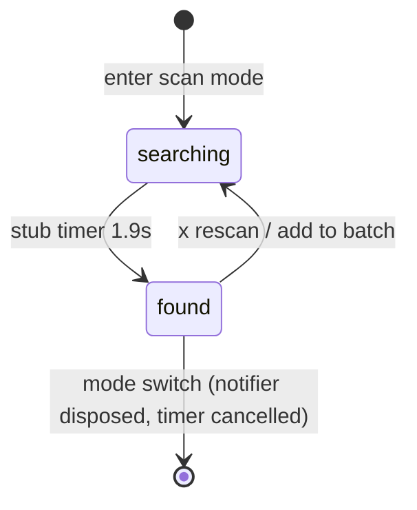

# Implementation Plan: Barcode Scan Mode (UI only)

Source design: `designs/Food logging app design-handoff/food-logging-app-design/project/Food Search.dc.html`,
the `scanMode` branch and the `scanVals` block of its script.

Single-document plan rather than the `requirements.md`/`design.md`/`tasks.md` split next door: this is
one screen mode with no schema, no wire format and no network, and the whole of it fits above the
noise floor of three documents.

## Problem statement

The search screen implements three of the design's four header modes. The fourth — barcode scan — was
deliberately left out; the `ponytail:` comment above `_header` in
`lib/features/search/presentation/search_screen.dart` says so. Build the scan interface now, with **no
barcode decoding and no `gtin_upc` lookup**, so the screen is visually complete and the later real
path only has to swap where a match comes from.

## Requirements

Settled with the user before planning:

1. **Match card is built now**, driven by a stub that resolves ~1.9 s after entering scan mode and
   cycles the design's four fake products, exactly as the prototype does.
2. **No camera plumbing.** The feed is the design's hatched placeholder with `[ LIVE CAMERA FEED ]`.
3. **Scan toggle is always available**, gated on camera presence only. Barcode scanning does not need
   the plate-detect service, so `plateApiConfigured` must not gate it.
4. **Torch and `enter code manually` are rendered inert** for visual fidelity. The prototype leaves
   manual entry handler-less too; the torch toggles its own amber state and reaches no hardware.
5. **The stub is unlabelled** — closest to the prototype. A single `ponytail:` comment and an obvious
   filename are the only markers.
6. Staging into the batch goes through the existing `BatchItem` → `Batch.logAll` path, so the header
   totals, the chip strip and the check button work unchanged.

## Background

Findings from the codebase that shape the design below.

- `aiAvailableProvider` (`presentation/ai_providers.dart`) returns
  `plateApiConfigured && availableCameras().isNotEmpty`. Scan mode needs the second half alone, so the
  probe splits out as `cameraAvailableProvider` and `aiAvailableProvider` is rebuilt on it. A move, not
  a new code path.
- A scanned product maps onto the existing `FoodHit` (per-100 g nutrients, `servingG`/`servingLabel`)
  plus the two fields the card adds: brand and code. The stepper is
  `portionFor(qty, PortionUnit(label, servingG))` from `domain/portion.dart` and `BatchItem(food,
  portion)` stages it. No new domain maths.
- The design's stub numbers are **per serving** (whey isolate: 120 kcal per 30 g scoop). `FoodHit` is
  per 100 g, so the stub converts once on the way in; `Portion.scale` converts back and the design's
  displayed numbers round-trip exactly.
- Staged stub items log through `saveCustomFood`'s quick-add branch, which stores per-100 g verbatim —
  correct, though the saved row keeps a `serving`/100 g label rather than `scoop`/30 g. Pre-existing
  quick-add behaviour; the real path resolves to a catalog row by code instead, so not worth touching.
- `AiCapturePane._SweepBar` is a **fade** on a static line, and private. The reticle needs a line that
  **travels** (top 12 → 138 px). Different motion, so a local animation rather than a shared
  abstraction over two unrelated ones.
- `lib/app/theme.dart` states the convention that a macro hue used for non-macro meaning gets its own
  alias (`merged`, `danger`). The found state's `#7FBF6A` is `carbs` again, so it gets one.
- Anything that animates forever breaks `pumpAndSettle`. The existing tests already work around the
  portion pad's blinking cursor with explicit `pump(Duration)`; the sweep and the pulsing dot mean scan
  tests must do the same. `test/search_test.dart` also shows the `_ignoreOverflow` helper the taller
  test font needs.

## Solution

Three new files plus edits to two existing ones, all under
`lib/features/search/presentation/` unless stated.

| File | Role |
| --- | --- |
| `camera_providers.dart` (new) | `cameraAvailableProvider`, moved out of `ai_providers.dart` |
| `scan_providers.dart` (new) | `ScanPhase`, an immutable `ScanSession` (phase, match index, qty, torch) with a hand-written `copyWith`, and `@riverpod class Scan` owning the arm timer, the 1..6 qty clamp, the torch flag and `rescan()` |
| `scan_stub.dart` (new) | The design's four products, per-serving numbers converted to `FoodHit`, behind one `ponytail:` comment naming the ceiling and the upgrade path. One file to delete when real scanning lands |
| `scan_pane.dart` (new) | The pane: placeholder feed, reticle with scrim cut-out and corner brackets, travelling sweep, status pill with pulsing dot, torch, hint, escape pills, match card |
| `search_screen.dart` | `_Mode.scan` first in the enum (design order: scan, search, ai, quick; default stays search), `scanToggleKey`, the toggle gated on `cameraAvailableProvider`, the `_body` case |
| `lib/app/theme.dart` | One alias for the found green |

`ScanSession` is a plain class rather than `@freezed`: four scalar fields, one writer, no extra part
file — the same justification `Shot` already carries in `domain/ai_plate.dart`.

### Deliberate deviations from the prototype

- The card renders the amount as **`qty × label`** (`2 × scoop`), not the prototype's pluralised
  `2 scoops`. `CLAUDE.md` states the invariant that portion labels are measures of *one*, and the chip
  strip and log entries already read that way.
- The sweep is a **local** animation, not `AiCapturePane`'s `_SweepBar` — see Background.

## Tasks

- [x] **1. Split the camera probe out from AI availability**

  - Move the `availableCameras()` probe into a new `camera_providers.dart` as
    `cameraAvailableProvider`, keeping its `CameraException`/`MissingPluginException` handling and the
    comment explaining why it is one call in a `try` rather than a conditional export
  - Rewrite `aiAvailableProvider` as
    `plateApiConfigured && await ref.watch(cameraAvailableProvider.future)`
  - Run `dart run build_runner build --delete-conflicting-outputs`
  - Verify: `flutter analyze` clean, `flutter test` green — `ai_plate_test.dart` and `search_test.dart`
    both rely on the AI toggle staying hidden in a headless host
  - Demo: AI mode behaves exactly as before; camera presence is now a question anything can ask
    without implying a plate service

- [x] **2. Scan mode entry and its searching state**

  - `search_screen.dart`: add `_Mode.scan`, `scanToggleKey`, a
    `_modeButton(Icons.qr_code_scanner, _Mode.scan)` rendered only when `cameraAvailableProvider` is
    true and placed left of the search toggle per the design, and the `_body` case returning `ScanPane`
  - `scan_pane.dart`, searching state: hatched 112° stripe background (`#181B12`/`#101207`, 16 px),
    radial vignette, bottom-centred `[ LIVE CAMERA FEED ]`; the 264×150 reticle with a
    `CustomPainter` scrim cut-out (`Path.combine` difference, `#080907` at 55 %, wrapped in
    `IgnorePointer`) and four 26 px amber corner brackets; the travelling sweep (2100 ms,
    `repeat(reverse: true)`, ease-in-out, top 12 → 138, inset 10); the `SCANNING` pill with its pulsing
    amber dot; the hint `center the barcode in the frame`; the inert torch reusing the AI pane's
    geometry; and the two escape pills — `enter code manually` inert, `search instead` switching back
  - Check the header still fits four toggles plus the log button at 402 px logical width. If the totals
    column overflows, take the toggles to 36 px rather than dropping a gap
  - Verify: widget test overrides `cameraAvailableProvider` true and `searchResultsProvider` empty,
    taps `scanToggleKey`, expects `SCANNING` and the placeholder text, then taps `search instead` and
    expects the search field back. Explicit `pump(Duration)` only
  - Demo: tapping the scan toggle shows the full searching interface, animating, with a working way out

- [x] **3. The stub source and the found transition**

  - `scan_stub.dart`: the four products — Torrent Nutrition whey isolate (scoop, 30 g, 120/27/2/1),
    Northfield Dairy Greek yogurt 2% (pot, 170 g, 100/17/6/3), Mill & Ash sourdough (slice, 50 g,
    120/4/24/1), Casa Verde black beans (can, 240 g, 190/12/34/1) — each per-serving vector converted
    to per 100 g, with brand, code and emoji from the design
  - `scan_providers.dart`: the session, the notifier arming a 1900 ms timer on build and cancelling it
    in `ref.onDispose`, and `rescan()` advancing to the next product with qty reset
  - Pane reads it: at `found` the pill turns green (`MATCH FOUND`), the reticle gains its 2 px green
    frame, the sweep stops, and the hint becomes `confirm the portion below`
  - Run build_runner
  - Verify: assert the conversion round-trips (whey isolate is 400 kcal/100 g and scales back to 120 at
    30 g) and the qty clamp holds at 1 and 6; widget test pumps 2 s and expects `MATCH FOUND`. The
    dispose-time cancel is what keeps the test from failing on a pending timer
  - Demo: enter scan mode, wait, watch it find a product

- [x] **4. The match card**

  - Bottom card: slide-up on appear (260 ms, the design's cubic-bezier), `#14160F` (`AppColors.field`)
    with the amber top border and 16 px top corners, bottom safe-area padding; the 46 px emoji tile,
    uppercase brand, name, code, the × rescan button; then the divider, the kcal figure with
    `macroLine` under it, and the −/+ stepper showing the portion label with grams beneath
  - Render the amount as `qty × label` — see Deliberate deviations
  - Add the found-green alias to `AppColors` and use it for the pill, the frame and the hint
  - Verify: widget test taps `+` twice and expects kcal and grams to track (120 → 360, 30 g → 90 g);
    taps × and expects `SCANNING` with the next product's name
  - Demo: a found product with a working quantity stepper

- [x] **5. Add to batch and keep scanning**

  - Wire the CTA: stage `BatchItem(match.food, portionFor(qty, unit))` into `batchProvider`, then
    `rescan()` — next product, qty 1, searching, timer rearmed
  - Confirm the chip strip and header totals update with no change to either, and that the empty-strip
    copy stays the design's batch label in scan mode (`showChips` is unconditionally true in the
    prototype and only AI mode overrides the label)
  - Verify: widget test taps the CTA, expects the product in the chip strip, the header total at the
    card's kcal, and the pane back to `SCANNING`; a second scan-and-add accumulates rather than
    replaces
  - Demo: scan → add → scan again → check button logs the batch, the whole loop the design describes

- [x] **6. Verification pass**

  - `flutter analyze` and the full `flutter test`
  - Confirm no pending-timer or leaked-controller failures, and that switching modes and popping the
    screen both cancel the arm timer
  - Confirm the header does not overflow at 402 px
  - Re-read the prototype's scan section against the built pane for the numbers that drift easily:
    reticle size, bracket size, pill and stepper metrics, font sizes
  - Demo: green analyze and test run, and the pane side by side with the design source

## Out of scope

Barcode decoding, a `gtin_upc` column in the catalog and the `generate-sqlite` change behind it, manual
code entry, and a live camera preview in scan mode. When decoding lands, `scan_stub.dart` is deleted and
`Scan.rescan` resolves against the catalog instead of the stub list; nothing else in the pane changes.
